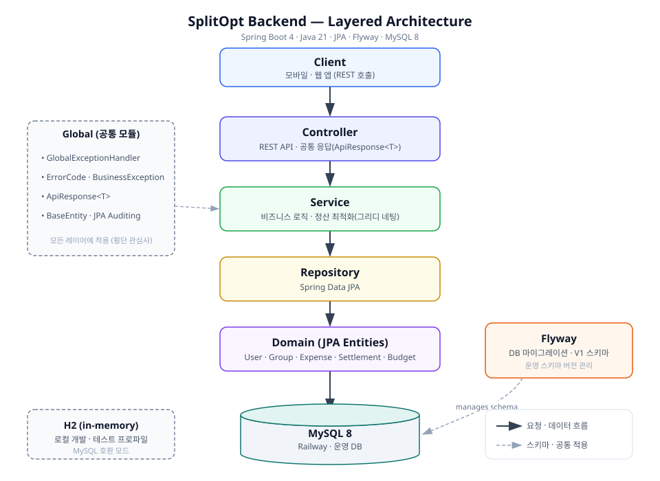

# SplitOpt Backend

> ECC 2026 Summer Project · Team 1

**모임 정산을 자동으로 최적화하는 더치페이 서비스**의 백엔드입니다.
누가 누구에게 얼마를 보내야 하는지 **그리디 네팅으로 송금 횟수를 최소화**하여 계산하고, 지출·예산·정산을 그룹 단위로 관리합니다.

<br>

## Architecture



레이어드 아키텍처(Controller → Service → Repository → Domain)를 따르며, 예외 처리·공통 응답·감사(Auditing)는 `global` 공통 모듈에서 횡단 관심사로 처리합니다. 운영 DB 스키마는 애플리케이션 코드가 아닌 **Flyway 마이그레이션**이 전담합니다.

<br>

## Tech Stack

| 구분 | 사용 기술 |
| --- | --- |
| Language | Java 21 |
| Framework | Spring Boot 4.1, Spring Web MVC, Spring Data JPA |
| Database | MySQL 8 (운영, Railway) · H2 in-memory (로컬·테스트) |
| Migration | Flyway (`flyway-mysql`) |
| Build | Gradle |
| Test | JUnit 5, Testcontainers (실 MySQL 검증) |
| CI / Deploy | GitHub Actions · Render(웹) + Railway(DB) |

<br>

## Project Structure

```text
com.splitopt.backend
├── global/                 # 공통 모듈
│   ├── config/             # JPA Auditing 등 설정
│   ├── entity/             # BaseEntity (created/updated 공통 컬럼)
│   ├── exception/          # ErrorCode · BusinessException · GlobalExceptionHandler
│   └── response/           # ApiResponse<T> (공통 응답 포맷)
├── user/                   # 사용자
├── group/                  # 모임 · 참여자(멤버십)
├── expense/                # 지출 · 부담 분배
└── settlement/             # 정산(송금 관계) · 예산
```

각 도메인은 `domain / repository / service / controller / dto` 하위 구조를 따릅니다.

<br>

## Database

운영 스키마는 `src/main/resources/db/migration/V1__init_schema.sql` (Flyway V1)로 관리하며, 다음 8개 테이블로 구성됩니다.

| 테이블 | 설명 |
| --- | --- |
| `users` | 사용자 |
| `groups` | 모임 (MySQL 예약어이므로 백틱 처리) |
| `group_participants` | 모임 참여자(멤버십) · soft-delete |
| `schedules` | 일정 |
| `expenses` | 지출 |
| `expense_shares` | 지출별 부담 분배 |
| `settlements` | 정산(송금 관계) |
| `budgets` | 모임 예산 (모임당 1개) |

- 금액은 `DECIMAL(12,2)`, 시각은 JPA `LocalDateTime`(마이크로초)에 맞춰 `DATETIME(6)`를 사용합니다.
- FK 13개 · CHECK 제약 8개로 참조 무결성과 도메인 규칙(금액 > 0, 상태 enum 등)을 DB 레벨에서 강제합니다.

<br>

## Getting Started

### Local (기본 프로파일 · H2)

```bash
./gradlew bootRun
```

- 내장 H2(MySQL 호환 모드)를 사용하며 Flyway는 비활성화, 엔티티 기반으로 스키마를 자동 생성합니다.
- 별도 DB 설치 없이 바로 실행됩니다.

### Production (prod 프로파일 · MySQL)

`prod` 프로파일에서는 접속 정보를 **코드에 두지 않고 환경변수로만** 주입합니다.

```bash
SPRING_PROFILES_ACTIVE=prod \
SPRING_DATASOURCE_URL=jdbc:mysql://<host>:<port>/<db> \
SPRING_DATASOURCE_USERNAME=<user> \
SPRING_DATASOURCE_PASSWORD=<password> \
./gradlew bootRun
```

- 스키마는 Flyway가 전담(`ddl-auto=none`)하며, 부팅 시 미적용 마이그레이션을 자동 실행합니다.

<br>

## Testing

```bash
./gradlew test
```

Flyway 마이그레이션은 **Testcontainers로 실제 MySQL 8 컨테이너**에 적용해 검증합니다. V1이 오류 없이 적용되는지, 8개 테이블·13개 FK·8개 CHECK 제약이 실제로 생성되고 **동작(잘못된 INSERT 거부)**하는지까지 확인합니다. Docker가 없는 환경에서는 해당 테스트가 자동으로 건너뛰어집니다.

<br>

## CI / Deployment

- **CI** — `main` 대상 push·PR에서 GitHub Actions가 `./gradlew test`를 실행합니다. (`.github/workflows/ci.yml`)
- **배포** — Render(웹 서버) + Railway(MySQL) 구성. 접속 정보는 Render 환경변수로만 주입하며 저장소에 커밋하지 않습니다.

<br>

## Team

<table>
  <tr>
    <td align="center" width="220">
      <a href="https://github.com/jieun-g"></a>
    </td>
    <td align="center" width="220">
      <a href="https://github.com/Chaebin49"></a>
    </td>
    <td align="center" width="220">
      <a href="https://github.com/subin21cc"></a>
    </td>
  </tr>
  <tr>
    <td align="center"><a href="https://github.com/jieun-g">@jieun-g</a></td>
    <td align="center"><a href="https://github.com/Chaebin49">@Chaebin49</a></td>
    <td align="center"><a href="https://github.com/subin21cc">@subin21cc</a></td>
  </tr>
  <tr>
    <td align="center">Auth</td>
    <td align="center">Expense</td>
    <td align="center">Settlement</td>
  </tr>
</table>

<br>

## Conventions

- 브랜치: `<파트>/<이름>/<기능>` (예: `be/subin/settlement`)
- 커밋·PR 제목: `[Type(scope)] 설명` (예: `[Test] 마이그레이션 검증 강화`)
